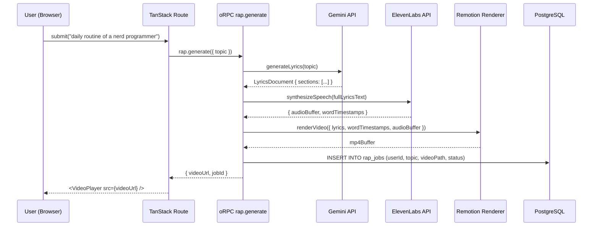
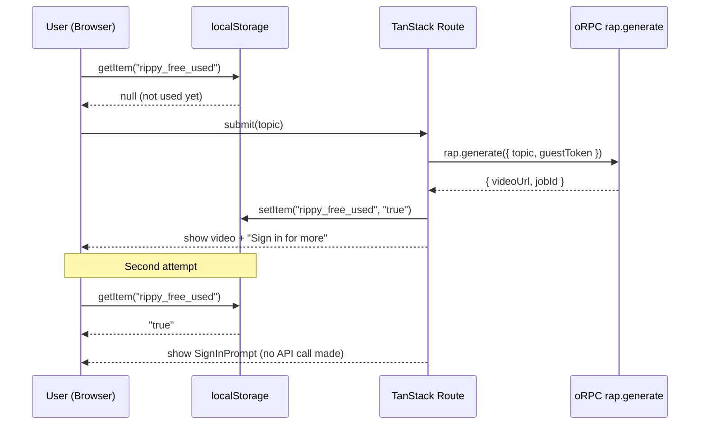

# Design Document: Rap Video Generator (Rippy)

## Overview

Rippy lets a user submit any topic and receive a short, shareable rap music video — a dark-background MP4 with animated captions synced word-by-word to AI-generated audio. The pipeline is fully server-side: Gemini generates lyrics, ElevenLabs generates audio with word-level timestamps, and Remotion renders the final MP4 from React components.

The feature is gated by a free-tier limit (1 generation tracked in `localStorage`) before requiring sign-in via Better Auth. Authenticated users get unlimited generations, and every generation is persisted in PostgreSQL via Drizzle ORM.

---

## Architecture

```mermaid
graph TD
    UI[RapGeneratorPage\nTanStack Route]
    ORPC[oRPC Procedure\nrap.generate]
    LYRICS[LyricsService\nGemini API]
    AUDIO[AudioService\nElevenLabs API]
    RENDER[RenderService\n@remotion/renderer]
    DB[(PostgreSQL\nDrizzle ORM)]
    FS[File Storage\n/public/videos or S3]
    AUTH[Better Auth\nSession Check]

    UI -->|topic + sessionToken| ORPC
    ORPC --> AUTH
    ORPC --> LYRICS
    LYRICS -->|structured lyrics| ORPC
    ORPC --> AUDIO
    AUDIO -->|audio buffer + word timestamps| ORPC
    ORPC --> RENDER
    RENDER -->|MP4 buffer| ORPC
    ORPC --> FS
    ORPC --> DB
    ORPC -->|videoUrl + jobId| UI
```

---

## Sequence Diagrams

### Happy Path: Authenticated User



### Free Tier: Guest User



---

## Components and Interfaces

### Component 1: `RapGeneratorPage`

**Purpose**: Main UI — topic input, generation state, video playback, download button.

**Interface**:
```typescript
// src/routes/rap.tsx
export default function RapGeneratorPage(): JSX.Element

// Internal state shape
interface GeneratorState {
  topic: string
  status: 'idle' | 'generating' | 'done' | 'error'
  videoUrl: string | null
  jobId: string | null
  error: string | null
}
```

**Responsibilities**:
- Check `localStorage` for free-tier usage before calling the API
- Show `<SignInPrompt>` when free tier is exhausted and user is not authenticated
- Stream generation progress via oRPC (or poll job status)
- Render `<VideoPlayer>` and download link once `videoUrl` is available

---

### Component 2: `RapVideoComposition` (Remotion)

**Purpose**: Remotion React composition that renders the animated caption video.

**Interface**:
```typescript
// src/remotion/RapVideoComposition.tsx
interface RapVideoProps {
  lyrics: LyricsDocument
  wordTimestamps: WordTimestamp[]
  durationInFrames: number
  fps: number  // 30
}

export function RapVideoComposition(props: RapVideoProps): JSX.Element
```

**Responsibilities**:
- Render a dark background (`#0a0a0a`) at 1080×1080 (square) or 1920×1080
- For each `LyricsSection`, apply its assigned `StylePreset`
- Animate each word using its timestamp: word appears at `startTime`, exits at next word's `startTime`
- Support four animation types: `pop`, `slide`, `shake`, `glow`

---

### Component 3: `LyricsSection` (Remotion sub-component)

**Purpose**: Renders one section (Hook/Verse/Bridge) with its style preset.

**Interface**:
```typescript
interface LyricsSectionProps {
  section: LyricsSection
  wordTimestamps: WordTimestamp[]
  stylePreset: StylePreset
  currentFrame: number
}
```

---

### Component 4: `SignInPrompt`

**Purpose**: Overlay shown when guest user has exhausted free tier.

**Interface**:
```typescript
interface SignInPromptProps {
  topic: string  // pre-fill after sign-in redirect
}
```

---

### Service 1: `LyricsService`

**Purpose**: Calls Gemini API to generate structured rap lyrics.

**Interface**:
```typescript
// src/lib/lyrics-service.ts
interface LyricsService {
  generateLyrics(topic: string): Promise<LyricsDocument>
}
```

---

### Service 2: `AudioService`

**Purpose**: Calls ElevenLabs API to synthesize speech and retrieve word-level timestamps.

**Interface**:
```typescript
// src/lib/audio-service.ts
interface AudioService {
  synthesize(text: string): Promise<AudioResult>
}
```

---

### Service 3: `RenderService`

**Purpose**: Invokes `@remotion/renderer` server-side to produce an MP4 buffer.

**Interface**:
```typescript
// src/lib/render-service.ts
interface RenderService {
  renderVideo(input: RenderInput): Promise<Buffer>
}
```

---

## Data Models

### `LyricsDocument`

```typescript
type SectionType = 'hook' | 'verse' | 'bridge' | 'outro'

interface LyricsLine {
  text: string       // full line text
  words: string[]    // tokenized words
}

interface LyricsSection {
  type: SectionType
  lines: LyricsLine[]
  stylePreset: StylePreset  // assigned at generation time
}

interface LyricsDocument {
  topic: string
  sections: LyricsSection[]
  fullText: string   // concatenated for TTS input
}
```

**Validation Rules**:
- `topic` must be 3–200 characters
- At least 1 section required; max 8 sections
- Each section must have at least 1 line

---

### `WordTimestamp`

```typescript
interface WordTimestamp {
  word: string
  startTime: number   // seconds from audio start
  endTime: number     // seconds
  confidence: number  // 0–1, from ElevenLabs alignment
}
```

---

### `StylePreset`

```typescript
type AnimationType = 'pop' | 'slide' | 'shake' | 'glow'

interface StylePreset {
  id: string
  fontFamily: string        // e.g. 'Impact', 'Bebas Neue', 'Montserrat'
  color: string             // hex
  accentColor: string       // hex, for glow/shadow
  animation: AnimationType
  fontSize: number          // px, relative to 1080p canvas
  textTransform: 'uppercase' | 'none'
}

// Built-in presets (one per section type)
const STYLE_PRESETS: Record<SectionType, StylePreset> = { ... }
```

---

### `AudioResult`

```typescript
interface AudioResult {
  audioBuffer: Buffer
  wordTimestamps: WordTimestamp[]
  durationSeconds: number
}
```

---

### `RenderInput`

```typescript
interface RenderInput {
  lyrics: LyricsDocument
  wordTimestamps: WordTimestamp[]
  audioBuffer: Buffer
  outputPath: string
}
```

---

### `RapJob` (Database)

```typescript
// Drizzle schema: src/db/schema.ts
interface RapJob {
  id: string           // uuid
  userId: string | null  // null for guest (free tier)
  topic: string
  status: 'pending' | 'processing' | 'done' | 'failed'
  videoPath: string | null
  errorMessage: string | null
  createdAt: Date
  updatedAt: Date
}
```

---

## Key Functions with Formal Specifications

### `generateLyrics(topic: string): Promise<LyricsDocument>`

**Preconditions**:
- `topic.length >= 3 && topic.length <= 200`
- Gemini API key is configured in environment

**Postconditions**:
- Returns a `LyricsDocument` with `sections.length >= 1`
- `fullText` equals the concatenation of all section lines
- Each section has a `stylePreset` assigned (deterministic based on `SectionType`)
- No section has empty `lines` array

**Error Handling**:
- Throws `LyricsGenerationError` if Gemini returns malformed JSON or empty content

---

### `synthesize(text: string): Promise<AudioResult>`

**Preconditions**:
- `text.length > 0`
- ElevenLabs API key and voice ID are configured

**Postconditions**:
- `audioBuffer.length > 0`
- `wordTimestamps.length > 0`
- Every word in `text` (after tokenization) has a corresponding `WordTimestamp`
- `wordTimestamps` are sorted ascending by `startTime`
- `durationSeconds > 0`

**Error Handling**:
- Throws `AudioSynthesisError` on API failure or missing alignment data

---

### `renderVideo(input: RenderInput): Promise<Buffer>`

**Preconditions**:
- `input.lyrics.sections.length >= 1`
- `input.wordTimestamps.length >= 1`
- `input.audioBuffer.length > 0`
- Remotion composition `RapVideoComposition` is registered

**Postconditions**:
- Returns a valid MP4 buffer (`buffer.length > 0`)
- Video duration matches `input.wordTimestamps` last `endTime` + 0.5s padding
- Every word appears on screen within ±1 frame of its `startTime`

**Loop Invariants** (frame rendering loop):
- For each frame `f`, exactly the words with `startTime <= f/fps < endTime` are visible
- Style preset for a section remains constant across all frames of that section

---

### `checkFreeTier(): { allowed: boolean; requiresAuth: boolean }`

**Preconditions**:
- Runs client-side only (accesses `localStorage`)

**Postconditions**:
- If `localStorage.getItem('rippy_free_used') === null` → `{ allowed: true, requiresAuth: false }`
- If `localStorage.getItem('rippy_free_used') === 'true'` and user is not authenticated → `{ allowed: false, requiresAuth: true }`
- If user is authenticated → `{ allowed: true, requiresAuth: false }` (ignores localStorage)

---

## Algorithmic Pseudocode

### Main Pipeline: `rap.generate` oRPC Procedure

```pascal
PROCEDURE rapGenerate(input)
  INPUT: input = { topic: String, sessionToken: String | null }
  OUTPUT: { videoUrl: String, jobId: String }

  SEQUENCE
    // Auth check
    user ← auth.getSession(input.sessionToken)
    IF user IS NULL AND freeTierAlreadyUsed(input.guestToken) THEN
      THROW AuthorizationError("Free tier exhausted. Sign in to continue.")
    END IF

    // Step 1: Generate lyrics
    lyrics ← lyricsService.generateLyrics(input.topic)
    ASSERT lyrics.sections.length >= 1

    // Step 2: Synthesize audio
    audioResult ← audioService.synthesize(lyrics.fullText)
    ASSERT audioResult.wordTimestamps.length > 0
    ASSERT isSortedAscending(audioResult.wordTimestamps, key: startTime)

    // Step 3: Assign style presets to sections
    FOR each section IN lyrics.sections DO
      section.stylePreset ← STYLE_PRESETS[section.type]
    END FOR

    // Step 4: Render video
    outputPath ← generateOutputPath(input.topic)
    mp4Buffer ← renderService.renderVideo({
      lyrics,
      wordTimestamps: audioResult.wordTimestamps,
      audioBuffer: audioResult.audioBuffer,
      outputPath
    })
    ASSERT mp4Buffer.length > 0

    // Step 5: Persist job
    jobId ← uuid()
    db.insert(rapJobs, {
      id: jobId,
      userId: user?.id ?? null,
      topic: input.topic,
      status: 'done',
      videoPath: outputPath
    })

    RETURN { videoUrl: `/videos/${jobId}.mp4`, jobId }
  END SEQUENCE
END PROCEDURE
```

---

### Lyrics Parsing: `parseLyricsFromGemini`

```pascal
PROCEDURE parseLyricsFromGemini(rawText)
  INPUT: rawText: String (Gemini response)
  OUTPUT: LyricsDocument

  SEQUENCE
    sections ← []
    currentSection ← null

    FOR each line IN rawText.split('\n') DO
      IF line MATCHES /^\[(Hook|Verse \d+|Bridge|Outro)\]/ THEN
        IF currentSection IS NOT NULL THEN
          sections.push(currentSection)
        END IF
        sectionType ← extractSectionType(line)
        currentSection ← { type: sectionType, lines: [] }
      ELSE IF line.trim() IS NOT EMPTY AND currentSection IS NOT NULL THEN
        words ← tokenize(line)
        currentSection.lines.push({ text: line, words })
      END IF
    END FOR

    IF currentSection IS NOT NULL THEN
      sections.push(currentSection)
    END IF

    ASSERT sections.length >= 1

    fullText ← sections
      .flatMap(s => s.lines)
      .map(l => l.text)
      .join(' ')

    RETURN { topic: input.topic, sections, fullText }
  END SEQUENCE
END PROCEDURE
```

---

### Frame Rendering: `getVisibleWords`

```pascal
FUNCTION getVisibleWords(wordTimestamps, currentFrame, fps)
  INPUT:
    wordTimestamps: WordTimestamp[]
    currentFrame: Number (Remotion useCurrentFrame())
    fps: Number (30)
  OUTPUT: WordTimestamp[]

  SEQUENCE
    currentTime ← currentFrame / fps

    visibleWords ← []
    FOR each wt IN wordTimestamps DO
      IF wt.startTime <= currentTime AND currentTime < wt.endTime THEN
        visibleWords.push(wt)
      END IF
    END FOR

    RETURN visibleWords
  END SEQUENCE
END FUNCTION
```

**Loop Invariant**: At any frame, `visibleWords` contains only words whose time window contains `currentTime`.

---

### Animation: `getWordAnimationStyle`

```pascal
FUNCTION getWordAnimationStyle(animationType, progress)
  INPUT:
    animationType: 'pop' | 'slide' | 'shake' | 'glow'
    progress: Number (0.0 to 1.0, interpolated from frame)
  OUTPUT: CSSProperties

  SEQUENCE
    MATCH animationType WITH
      CASE 'pop':
        scale ← interpolate(progress, [0, 0.3, 1], [0, 1.3, 1])
        RETURN { transform: `scale(${scale})`, opacity: progress }

      CASE 'slide':
        translateY ← interpolate(progress, [0, 1], [40, 0])
        RETURN { transform: `translateY(${translateY}px)`, opacity: progress }

      CASE 'shake':
        IF progress < 0.5 THEN
          translateX ← interpolate(progress, [0, 0.25, 0.5], [-8, 8, -4])
        ELSE
          translateX ← 0
        END IF
        RETURN { transform: `translateX(${translateX}px)` }

      CASE 'glow':
        glowRadius ← interpolate(progress, [0, 0.5, 1], [0, 20, 10])
        RETURN { textShadow: `0 0 ${glowRadius}px currentColor`, opacity: progress }
    END MATCH
  END SEQUENCE
END FUNCTION
```

---

## Example Usage

```typescript
// oRPC client call from RapGeneratorPage
const result = await orpc.rap.generate.call({
  topic: "daily routine of a nerd programmer"
})
// result: { videoUrl: "/videos/abc123.mp4", jobId: "abc123" }

// Remotion composition usage (server-side render)
const mp4 = await renderMedia({
  composition: {
    id: 'RapVideo',
    component: RapVideoComposition,
    durationInFrames: Math.ceil(durationSeconds * 30),
    fps: 30,
    width: 1080,
    height: 1080,
    props: { lyrics, wordTimestamps, durationInFrames, fps: 30 }
  },
  codec: 'h264',
  outputLocation: outputPath,
  inputProps: { lyrics, wordTimestamps, durationInFrames, fps: 30 }
})

// Style preset lookup
const preset = STYLE_PRESETS['hook']
// { fontFamily: 'Impact', color: '#FFD700', animation: 'pop', ... }
```

---

## Correctness Properties

1. **Timestamp Monotonicity**: For all consecutive word timestamps `[w_i, w_{i+1}]`, `w_i.startTime < w_{i+1}.startTime`.
2. **Full Coverage**: Every word in `lyrics.fullText` (after tokenization) has exactly one corresponding `WordTimestamp`.
3. **Frame Determinism**: For any given `currentFrame` and `wordTimestamps`, `getVisibleWords` returns the same result (pure function, no side effects).
4. **Style Consistency**: All words within a `LyricsSection` share the same `StylePreset` throughout the video.
5. **Free Tier Enforcement**: A guest user can call `rap.generate` at most once; subsequent calls without authentication return `AuthorizationError`.
6. **Video Duration Bound**: `durationInFrames = ceil((lastWordTimestamp.endTime + 0.5) * fps)` — video never ends before the last word finishes.

---

## Error Handling

### Scenario 1: Gemini Returns Malformed Lyrics

**Condition**: Gemini response cannot be parsed into `LyricsDocument` (missing section labels, empty content).
**Response**: Throw `LyricsGenerationError` with message. oRPC returns `{ code: 'LYRICS_PARSE_ERROR' }`.
**Recovery**: UI shows "Couldn't generate lyrics for that topic — try rephrasing."

### Scenario 2: ElevenLabs Missing Word Timestamps

**Condition**: ElevenLabs response contains audio but alignment data is absent or incomplete.
**Response**: Throw `AudioSynthesisError`. Fall back to evenly distributing words across audio duration.
**Recovery**: Video renders with estimated timestamps (lower quality sync, but still functional).

### Scenario 3: Remotion Render Failure

**Condition**: `@remotion/renderer` throws during `renderMedia` (OOM, codec error, etc.).
**Response**: Update `rapJobs.status = 'failed'`, log error. Return `{ code: 'RENDER_FAILED' }`.
**Recovery**: UI shows "Video rendering failed — please try again."

### Scenario 4: Free Tier Exhausted (Client-Side)

**Condition**: `localStorage.getItem('rippy_free_used') === 'true'` and user is not authenticated.
**Response**: Block API call client-side. Show `<SignInPrompt topic={topic} />`.
**Recovery**: User signs in → redirect back with topic pre-filled → generation proceeds.

---

## Testing Strategy

### Unit Testing Approach

- `parseLyricsFromGemini`: test with valid multi-section input, missing labels, empty string
- `getVisibleWords`: property-test with arbitrary timestamps and frame values
- `getWordAnimationStyle`: test each animation type at `progress = 0`, `0.5`, `1.0`
- `checkFreeTier`: test all three states (unused, used+guest, used+authenticated)

### Property-Based Testing Approach

**Library**: `fast-check`

- **Timestamp monotonicity**: For any generated `LyricsDocument`, after calling `synthesize`, `wordTimestamps[i].startTime < wordTimestamps[i+1].startTime` for all `i`.
- **Frame determinism**: `getVisibleWords(ts, f, fps)` is a pure function — same inputs always produce same outputs.
- **Style preset completeness**: For any `SectionType`, `STYLE_PRESETS[type]` is defined and has all required fields.

### Integration Testing Approach

- Mock Gemini and ElevenLabs APIs; test the full `rap.generate` oRPC procedure end-to-end
- Verify `rapJobs` row is inserted with correct `status: 'done'` and non-null `videoPath`
- Test free-tier enforcement: second guest call returns `AuthorizationError`

---

## Performance Considerations

- Remotion rendering is CPU-intensive — run in a worker thread or separate process to avoid blocking the Node.js event loop
- ElevenLabs audio synthesis is the primary latency bottleneck (~2–5s for a 30s rap); show a progress indicator
- MP4 files should be served from a CDN or object storage (S3) in production, not from the app server's filesystem
- Consider a job queue (e.g., BullMQ) for production to handle concurrent render requests without OOM

---

## Security Considerations

- Sanitize `topic` input server-side before passing to Gemini (prevent prompt injection)
- Rate-limit the `rap.generate` oRPC endpoint per IP (even for authenticated users)
- Store API keys (`GEMINI_API_KEY`, `ELEVENLABS_API_KEY`) in server-only environment variables — never expose to client
- Generated video files should have non-guessable paths (UUID-based) to prevent enumeration
- Free-tier `guestToken` should be a server-issued short-lived token (not just localStorage flag) to prevent trivial bypass

---

## Dependencies

| Package | Purpose | Status |
|---|---|---|
| `@tanstack/ai-gemini` | Gemini API client | Already in `package.json` |
| `@remotion/renderer` | Server-side MP4 rendering | Needs install |
| `remotion` | Remotion React components | Needs install |
| `@remotion/player` | In-browser video preview | Needs install |
| `elevenlabs` | ElevenLabs SDK (TTS + timestamps) | Needs install |
| `better-auth` | Authentication | Already in stack |
| `drizzle-orm` | Database ORM | Already in stack |
| `fast-check` | Property-based testing | Needs install (devDep) |

**Install command**:
```bash
pnpm add remotion @remotion/renderer @remotion/player elevenlabs
pnpm add -D fast-check
```
